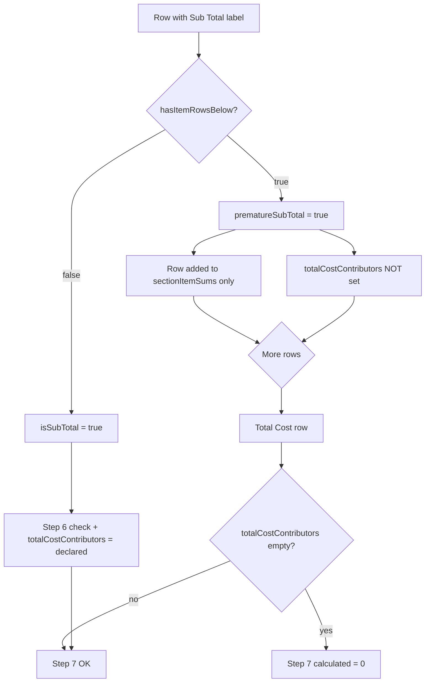

# BOQ Step 6/7 Validation — Post-Commit Regression Diagnosis

**Date:** 2026-06-30  
**Scope:** 15 errors across 4 sheets (cwra, so & Tra, sma, dsa) after commits `843883b`, `4b86cab`, `b995aaa`, `26003d2`.  
**File:** `backend/api/src/modules/dpr-planning/utils/dpr-boq-validation.util.ts` → `validateTotalRows` (lines 751–887).

---

## Executive summary

| Pattern | Sheets | Root cause (confidence) |
|---------|--------|-------------------------|
| Step 7 all columns calculated **₹0** | so & Tra, sma, dsa | **High** — `totalCostContributors` never populated when the only “Sub Total” row is flagged **premature** (`hasItemRowsBelow` = true). No second real subtotal before “Total Cost”. |
| Step 6 UJN **exactly 2×** (951,892 → 19,03,784) | cwra | **High** — `sectionItemSums` includes **rows 1–7** (~951,892 UJN) **plus** **row 8** (951,892 UJN again). User expects Step 6 at row 11 = **row 8 + row 10 only**, not rows 1–7 + row 8. |
| Step 6 regression 0 → 2× | cwra | Commit `4b86cab` (`prematureSubTotal`) made row 8 count as a contributing item; prior commits (`843883b`/`b995aaa`) made rows 1–7 contribute via `sectionRowColumnAmounts` / lump-sum fallbacks. Combined → double UJN. |

**Two distinct bugs.** Step 7 zero has a clear code fix. Step 6 cwra 2× needs user confirmation of section boundaries (rows 1–7 vs row 8).

---

## Git commit context (inferred — git unavailable in diagnosis environment)

| Commit | Likely change | Interaction |
|--------|---------------|-------------|
| `843883b` | Tharali column reads / lump-sum fallbacks in `sectionRowColumnAmounts`, `sectionLumpSumFallback` | Rows 1–7 on cwra now contribute to `sectionItemSums` (was **0** before → user saw “calculated 0”) |
| `4b86cab` | `hasItemRowsBelow`, `prematureSubTotal`, `resolveSubTotalLabel` | Row 8 mislabeled “Sub Total” treated as **item** when rows 9–10 follow; **does not** set `totalCostContributors` |
| `b995aaa` | Further Step 6/7 column-sum refinements | Extends item capture; amplifies double-count when row 8 also contributes |
| `26003d2` | Follow-up / merge of above | Current combined behaviour |

**Conflict:** `4b86cab` fixes cwra row 8→11 vertical sum when **only** rows 8+10 exist, but breaks Step 7 when a single premature “Sub Total” precedes “Total Cost”, and combines with `843883b` to **double** UJN when rows 1–7 and row 8 both carry the same UJN block.

---

## User-stated Excel rules

| Rule | User expectation |
|------|------------------|
| cwra Step 6 | **Row 8 + row 10** amounts sum to **row 11** Sub Total (not rows 1–7 + row 8 + row 10) |
| Step 7 (all sheets) | **Sub Total row amounts** + any **item rows after** Sub Total = **Total Cost** row |
| cwra row 8 | May be mislabeled “Sub Total” but is really a **lump-sum / partial-total row**, not the Step 6 checkpoint |

---

## Code trace — key state variables

```751:887:backend/api/src/modules/dpr-planning/utils/dpr-boq-validation.util.ts
// sectionItemSums     — accumulated item rows for Step 6 Sub Total check
// totalCostContributors — base for Step 7 Total Cost (= subtotal declared + post-subtotal items)
// afterSubtotalForTotalCost — when true, post-subtotal items add to totalCostContributors
```

### Step 6 subtotal detection (lines 776–833)

| Step | Function / lines | Logic |
|------|------------------|-------|
| 1 | `resolveSubTotalLabel` (674–678) | “Sub Total” in description column, or in joined row text if description blank |
| 2 | `hasItemRowsBelow` (681–702) | Scans rows below; returns **true** if any row has amounts and is not description-only |
| 3 | Lines 777–778 | `prematureSubTotal = hasSubTotalLabel && hasItemRowsBelow`; `isSubTotal = hasSubTotalLabel && !prematureSubTotal` |
| 4 | Lines 781–790 | Non-subtotal rows contribute to `sectionItemSums` via `sectionRowColumnAmounts` |
| 5 | Lines 793–833 | **Only** when `isSubTotal === true`: emit Step 6 check, set `totalCostContributors = declared`, reset `sectionItemSums` |

**cwra row 8:** If rows 9–10 exist with amounts, row 8 is **premature** → contributes to `sectionItemSums` but **no Step 6** at row 8. Real Step 6 fires at row 11.

**cwra row 11 Step 6 UJN 2×:** With rows 1–7 in the sheet, `sectionItemSums.ujn` = sum(1–7) + row 8 = **951,892 × 2** (reproduced locally: computed **19,03,780** vs declared **951,892**).

### Step 7 `totalCostContributors` (lines 764–765, 787–788, 830–831, 836–847)

| Step | Lines | Logic |
|------|-------|-------|
| Base capture | 830–831 | `totalCostContributors = declared` only inside `if (isSubTotal)` |
| Post-subtotal items | 787–788 | Added only when `afterSubtotalForTotalCost === true` |
| Step 7 computed | 845–847 | Uses `totalCostContributors`; fallback to `lineSum` **only for grand total**, not Total Cost |
| Reset | 880–881 | Cleared after Total Cost row |

**Why Step 7 = ₹0:** If the only “Sub Total” row is **premature** (items below before Total Cost), lines 830–831 **never run** → `totalCostContributors` stays `{}` → every column compares Excel value vs **0**.

**Reproduced:** Sub Total row 2 + item row 3 + Total Cost row 11 → all Step 7 columns calculated **0** (see `tmp-diagnose2.js` scenario `premature subtotal row2`).

**Secondary Step 7 = 0 path:** Sub Total row amounts only in **Rate** column (readable by `sectionRowColumnAmounts` but not `rowColumnAmounts`). Line 796 `hasDeclared` false → entire `isSubTotal` block skipped → same zero base.

---

## Error pattern tables

### A. cwra — Step 6 row 8/11, UJN 2×

| | User / Excel | Code behaviour |
|---|-------------|----------------|
| **Section scope** | Row 8 + row 10 → row 11 | Sums **rows 1–7 + row 8 + row 10** |
| **Row 8 role** | Lump-sum / mislabeled partial total | `prematureSubTotal` → counted as **item** in `sectionItemSums` |
| **Row 11 Step 6 UJN** | Declared **951,892** | Computed **19,03,784** (= 2 × 951,892) |
| **Regression** | Was calculated **0** (items not captured) | Now **2×** (items captured **and** row 8 duplicated) |
| **Functions** | — | `validateTotalRows` 781–790 (`sectionItemSums`), `sectionRowColumnAmounts` 612–642, `hasItemRowsBelow` 681–702, `prematureSubTotal` 777–783 |

### B. so & Tra / sma / dsa — Step 7 all ₹0

| | User / Excel | Code behaviour |
|---|-------------|----------------|
| **Step 7 formula** | Sub Total + items after = Total Cost | `totalCostContributors` empty → computed **0** |
| **Sub Total row** | Has correct DSR/UJN/SOR/NSI/Total | Flagged **premature** because item/description rows exist below it |
| **Second Sub Total** | Not present before Total Cost | Code never hits `isSubTotal` block to capture base |
| **Functions** | — | `validateTotalRows` 777–778, 793–796 (`hasDeclared` skip), 830–831 (base capture), 845–847 (Step 7 compare) |

### C. dsa — 4 errors

Same Step 7 = 0 pattern as so & Tra / sma (likely one Total Cost row × four amount columns).

---

## Conflicting subtotal changes



**Break introduced by `4b86cab`:** Path D→G→K. Before premature detection, a lone “Sub Total” row always took path C.

**Break amplified by `843883b`/`b995aaa`:** Path D→F also adds row 8 into `sectionItemSums` while rows 1–7 already summed → cwra Step 6 2×.

---

## Tests

```bash
cd backend/api && npm run test:boq-section-totals
```

**Result:** All 10 inline tests **pass** (2026-06-30).

Tests cover cwra row 8 premature + row 11, so & Tra Step 7, rate lump sums — but **do not** cover:

1. cwra with **rows 1–7 + row 8 + row 10 + row 11** (2× UJN) — production layout
2. **Single premature Sub Total + items + Total Cost** without second Sub Total (Step 7 = 0) — so & Tra / sma / dsa layout

---

## Recommended fix (Step 7 — high confidence)

When `prematureSubTotal === true` and the row has declared amounts:

1. Set `totalCostContributors = sectionRowColumnAmounts(...)` (not `rowColumnAmounts` — handles Rate-column lump sums)
2. Set `afterSubtotalForTotalCost = true`

This restores Step 7 = subtotal base + post-subtotal items without emitting a false Step 6 at the premature row.

---

## Open questions for user (cwra Step 6)

1. **Rows 1–7:** Are they a **closed prior section** (with their own Sub Total above row 8), or part of the same Step 6 roll-up as row 11?
2. **Row 8 label:** Exact description cell text — is it literally “Sub Total” or an item description?
3. **Confirm row numbers** on each sheet: Sub Total row, Total Cost row, first item row after Sub Total.
4. **dsa / sma:** Same structure as so & Tra (one Sub Total then items then Total Cost on row 11/22)?

---

## Local reproduction scripts

Temporary scripts used during diagnosis (safe to delete):

- `backend/api/tmp-diagnose.js` — cwra 2× with rows 1–7 + row 8
- `backend/api/tmp-diagnose2.js` — Step 7 zero on premature subtotal
